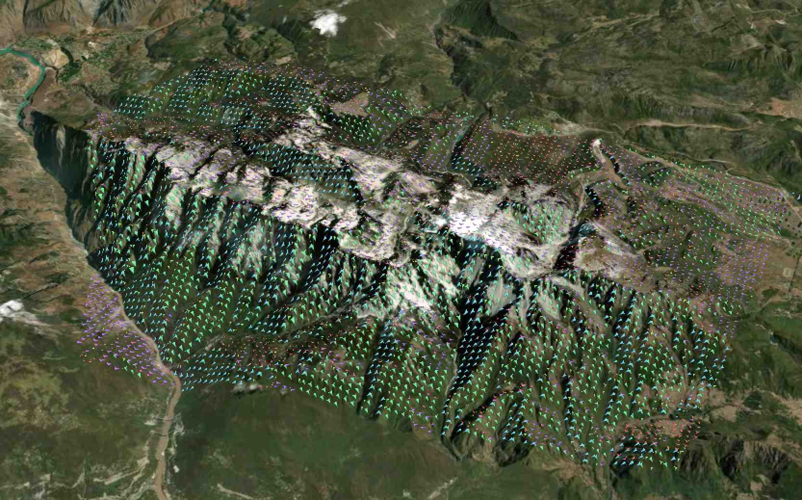
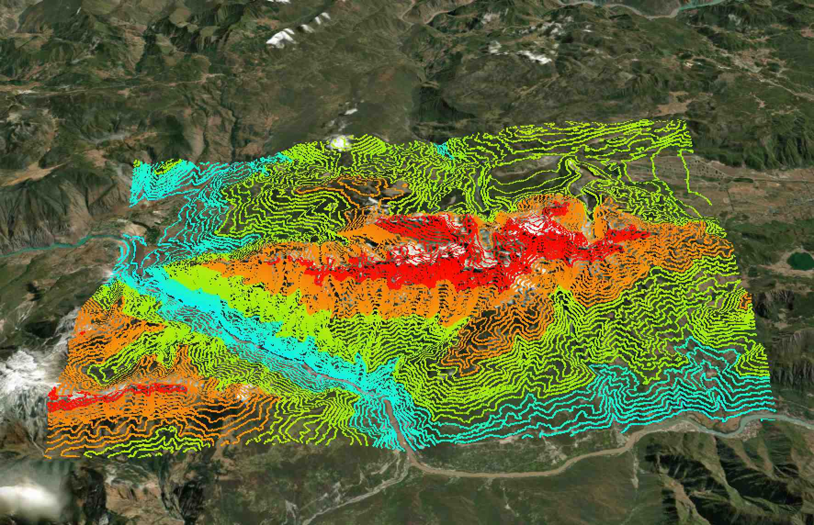

<p align="center">
</p>

<p align="center" style="font-weight:bolder;">CDK</p>

[中文](./README_zh.md)

A powerful geospatial analysis toolkit built on Cesium, designed to efficiently handle complex geospatial data analysis and visualization needs while seamlessly integrating into existing projects.


## Usage

Install 

```bash
npm install @giserlab/cdk
# or
pnpm i @giserlab/cdk
```


Run demo 

```bash
# clone repo
git clone https://github.com/giserlab/cdk.git
cd cdk
# install dependencies
pnpm i -w
cd demo 
pnpm i --ignore-workspace
# run
pnpm run dev
```


[API Documentation](https://giserlab.github.io/docs/cdk/index.html)


- [x] Aspect

- [x] Buffer
- [x] Height restriction detect
- [x] Isosurface
- [x] Contour line
- [x] Line-of-sight
- [x] Cross-section
- [ ] Viewshed


## Screenshots

Some screenshots.



<p align="center">Aspect </p>


<p align="center">Isosurface </p>




<p align="center">Contour </p>


  

<p align="center">Height restriction </p>


  

  
