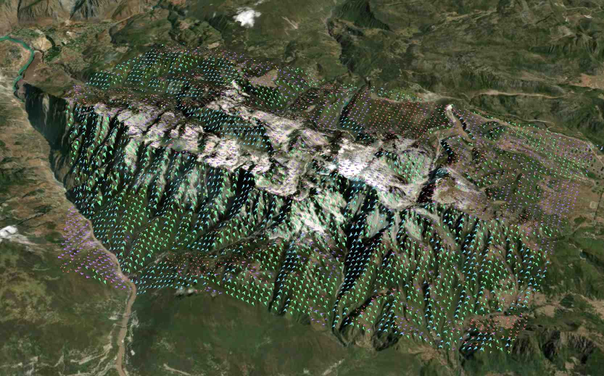
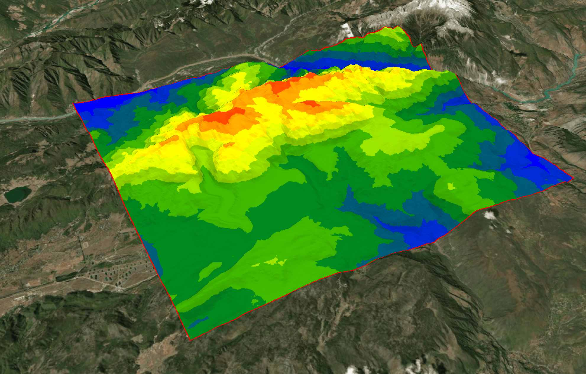
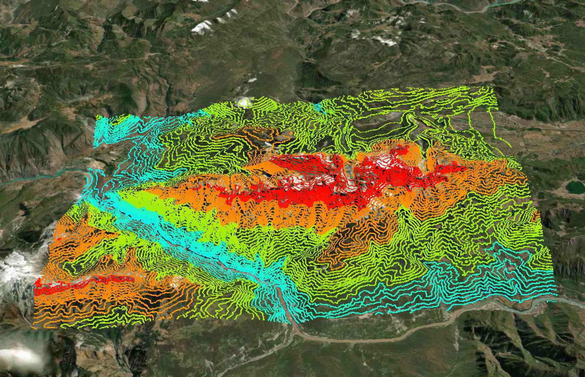
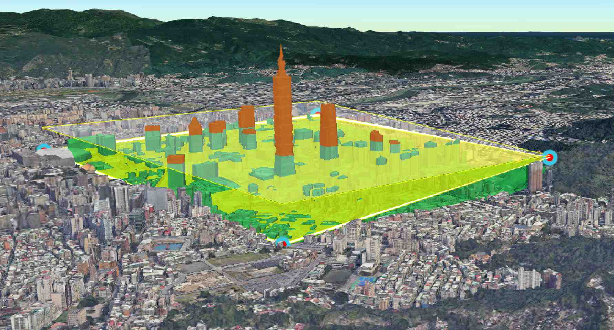

<p align="center">
</p>

<p align="center" style="font-weight:bolder;">CDK</p>


CDK ( Cesium Development Kit ) 一款高效、强大的地理空间分析包，基于Cesium开发，提供丰富分析功能，帮助您快速实现复杂的地理信息分析与可视化需求。


## 特点

**✓** 基于Cesium引擎，提供多种空间分析功能，满足专业GIS分析需求

**✓** 提供简洁API接口，轻松集成到现有Cesium项目中，快速扩展应用功能


## 使用

通过`npm`/`pnpm`安装

```bash
npm i @giserlab/cdk
# 或者
pnpm i @giserlab/cdk
```

[API文档](https://giserlab.github.io/docs/cdk/index.html)


- [x] 坡向分析

- [x] 缓冲区分析

- [x] 高度控制分析

- [x] 等值面分析

- [x] 等高线分析

- [x] 通视分析

- [x] 剖面线分析

- [ ] 视域分析


## 截图



<p align="center">坡向分析</p>      




<p align="center">等值面 </p>    




<p align="center">等高线 </p>  


  

<p align="center">控高检测 </p>


  

  
